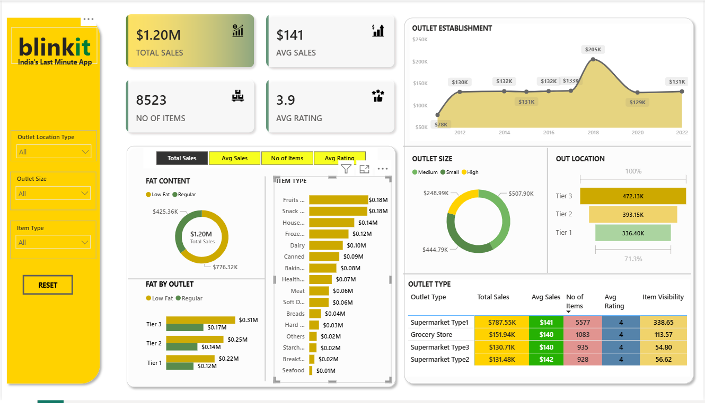

# 📊 Blinkit Sales Analysis Dashboard – Power BI Project  

## 🔹 Business Requirements  
The dashboard was designed to meet the following requirements:  

- Conduct a **comprehensive analysis** of Blinkit's sales performance, customer satisfaction, and inventory distribution.  
- Track **KPIs**:  
  - Total Sales (overall revenue from items sold)  
  - Average Sales (average revenue per sale)  
  - Number of Items (count of different items sold)  
  - Average Rating (customer rating of items sold)  
- Provide **granular insights** into:  
  - Total Sales by **Fat Content** (and related KPIs)  
  - Total Sales by **Item Type**  
  - Sales by **Outlet Establishment Year**  
  - Percentage of Sales by **Outlet Size**  
  - Sales by **Outlet Location Type**  
  - All KPIs compared by **Outlet Type**  

---

## 🔹 Project Overview  
This project analyzes **Blinkit sales data** to uncover patterns across products, outlets, and customer preferences.  
The **interactive Power BI dashboard** helps business teams track KPIs, evaluate outlet performance, and make data-driven decisions.  

---

## 🔹 Dataset  
- **Source**: Kaggle / Sample Blinkit dataset  
- **Data Fields**:  
  - Item Type  
  - Outlet Location Type  
  - Outlet Size  
  - Fat Content  
  - Total Sales  
  - Item Visibility  
  - Average Rating  

---

## 🔹 Tools & Technologies  
- **Power BI** – Data Visualization & Dashboarding  
- **Power Query (ETL)** – Data cleaning & transformation  
- **DAX** – Calculated columns & measures  
- **Excel/CSV** – Raw data handling  

---

## 🔹 Key Features of Dashboard  
✅ KPI Cards: Total Sales, Avg Sales, Avg Rating, No. of Items  
✅ Filters: Outlet Location, Outlet Size, Item Type  
✅ Donut Chart: Sales by Item Type & Fat Content  
✅ Bar Charts: Sales by Outlet Establishment Year & Outlet Size  
✅ Geographic Analysis: Sales by Outlet Location  
✅ Comparison of Outlet Types (Supermarket, Grocery Store, etc.)  

---

## 🔹 Dashboard Preview  
  

---

## 🔹 Insights & Findings  
- **Tier 3 outlets** generate the highest sales (~$472K).  
- **Medium outlets** outperform small and high-size outlets in sales.  
- **Supermarket Type1** contributes the maximum sales (~$787K).  
- **Regular items** dominate sales compared to Low Fat items.  

---

## 🔹 Business Impact  
📌 Helps Blinkit identify **top-performing outlets & products**.  
📌 Provides insights for **inventory optimization** and **marketing strategy**.  
📌 Equips leadership with a **single-page interactive dashboard** for quick decision-making.  

---

## 🔹 Author  
👤 **Ganesh Markanti**  
📌 Data Analyst | Power BI | SQL | Excel | ETL | AI Analytics  
🌐 [LinkedIn](https://www.linkedin.com/in/ganesh-markanti-366429177/)  
📧 ganeshmarkanti984@gmail.com  
